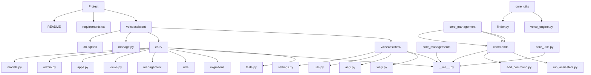

# Voice Assistant 

<div align="center">


</div>

> Примітивний голосовий асистент на Django, який слухає команду, відтворює відповіді і може запускати програми.

<details>
<summary>English version</summary>

> A primitive Django-based voice assistant that listens to commands, plays back responses, and can run programs.
</details>

<a id="articles"><h3>Table of contents</h3></a>

- [Project Description](#headers)
- [Project Structure](#structure)
- [Getting Started](#getting_started)
- [Requirements](#requirements)
- [How to Use](#how_to_use)
- [App Modules](#modules)
- [Project Notes](#notes)
- [Conclusion](#conclusions)

 #

<a id="headers"><h1>📋 Project description</h1></a>

Цей проєкт реалізує голосового асистента на Django. Він об'єднує:
- розпізнавання голосу через `SpeechRecognition`,
- відтворення мови через `edge-tts` і `pygame`,
- керування командами через Django-модель,
- запуск локальних програм за голосовими ключовими словами.

Мета проєкту — показати, як можна інтегрувати Django з голосовим вводом і простими асинхронними звуковими задачами.

<details>
<summary>English version</summary>

This project is a Django voice assistant prototype. It combines:
- voice recognition using `SpeechRecognition`,
- text-to-speech output with `edge-tts` and `pygame`,
- command storage in Django models,
- launching local applications by spoken keywords.

The goal is to demonstrate how Django can work with voice input and simple audio tasks.

</details>

#

[⬆️ Table of contents](#articles)

 #

<a id="structure"><h1>🏗️ Structure of project</h1></a>



#

[⬆️ Table of contents](#articles)

#

<a id="getting_started"><h1>🚀 Getting started</h1></a>

## Install Python and modules

Якщо ви ніколи не встановлювали Python:
- Завантажте інсталятор Python
  - Перейдіть на офіційний [Python website](https://www.python.org)
  - Перейдіть до розділу "Завантаження". Сайт автоматично визначає вашу операційну систему та відображає відповідну версію.
- Виберіть правильну версію
  - Для більшості користувачів рекомендується остання стабільна версія.
- Завантажте інсталятор
  - Натисніть кнопку Завантажити Python у верхньому правому куті екрана.
- Налаштуйте параметри встановлення
  - Поставте прапорець «Додати Python до PATH» у нижній частині вікна інсталятора. Цей крок є ключовим для запуску Python з командного рядка.
- Встановіть Python
  - Натисніть кнопку «Встановити зараз» і дочекайтеся завершення встановлення.
- Перевірте інсталяцію
  - Після встановлення відкрийте термінал або командний рядок.
    <details>
    <summary>Operating system</summary>

    - On Windows: Press `Win + R`, type `cmd`, and press Enter.
    - On macOS/Linux: Open the Terminal application.
    </details>
  - Введіть `python --version` або `python3 --version` та натисніть Enter.
- Якщо Python встановлено правильно, ви побачите встановлену версію.

Якщо ви все ще не розумієте, як встановити Python, можете подивитися [тут](https://www.youtube.com/watch?v=rc1BNaK609s)

#

[⬆️ Table of contents](#articles)

#

## Installing this project

1. Клонуйте проєкт
   - Перейдіть на головну сторінку проєкту на GitHub.
   - Натисніть зелену кнопку «Code», розташовану вгорі праворуч.
   - Виберіть параметр HTTPS і скопіюйте URL-адресу проєкту.

2. Відкрийте проєкт у IDE
   - Запустіть бажану IDE (VS Code, PyCharm або іншу).
   - Натисніть `Control + J` або просто створіть новий термінал і напишіть:
     ```
     git clone https://github.com/MaksymmS/Intensive-Intelligent-assistant.git
     ```

3. Підготуйте проєкт до використання
   ```
   cd Intensive-Intelligent-assistant/voiceassistent
   ```

4. Створіть віртуальне середовище

   Для macOS/Linux:
   ```
   python3 -m venv venv
   ```
   Для Windows:
   ```
   python -m venv venv
   ```

5. Активуйте віртуальне середовище

   На macOS/Linux:
   ```
   source venv/bin/activate
   ```
   На Windows:
   ```
   venv\Scripts\activate
   ```

6. Встановіть залежності проєкту
   ```
   pip3 install -r requirements.txt
   ```

> У цьому проєкті не потрібен `.env` для запуску локально. Всі налаштування збережені у `voiceassistent/voiceassistent/settings.py`.


<details>
<summary>English version</summary>

### Installing Python

If you've never installed Python before:
- Download the Python installer
  - Go to the official [Python website](https://www.python.org)
  - Go to the "Downloads" section — the site detects your OS automatically.
- Choose the right version
  - The latest stable version is recommended for most users.
- Run the installer
  - Click the Download Python button in the top right corner.
- Configure installation settings
  - Check the "Add Python to PATH" box at the bottom of the installer window. This step is key to running Python from the command line.
- Install Python
  - Click "Install Now" and wait for the installation to finish.
- Verify the installation
  - After installation, open a terminal or command prompt.
    <details>
    <summary>Operating system</summary>

    - On Windows: Press `Win + R`, type `cmd`, and press Enter.
    - On macOS/Linux: Open the Terminal application.
    </details>
  - Type `python --version` or `python3 --version` and press Enter.
- If Python is installed correctly, you will see the installed version.

If you still don't understand how to install Python, you can watch [this video](https://www.youtube.com/watch?v=uge4A1LHsNk)

### Installing this project

1. Clone the project
   - Go to the project's main page on GitHub.
   - Click the green "Code" button in the top right corner.
   - Select the HTTPS option and copy the project's URL.

2. Open the project in an IDE
   - Launch your preferred IDE (VS Code, PyCharm, etc.).
   - Press `Control + J` or create a new terminal and type:
     ```
     git clone https://github.com/MaksymmS/Intensive-Intelligent-assistant.git
     ```

3. Prepare the project
   ```
   cd Intensive-Intelligent-assistant/voiceassistent
   ```

4. Create a virtual environment

   For macOS/Linux:
   ```
   python3 -m venv venv
   ```
   For Windows:
   ```
   python -m venv venv
   ```

5. Activate the virtual environment

   On macOS/Linux:
   ```
   source venv/bin/activate
   ```
   On Windows:
   ```
   venv\Scripts\activate
   ```

6. Install the project's dependencies
   ```
   pip3 install -r requirements.txt
   ```

> This project does not require an .env to run locally. All settings are saved in voiceassistent/voiceassistent/settings.py.
</details>

#

[⬆️ Table of contents](#articles)

 #

<a id="requirements"><h1>⚙️ Requirements</h1></a>

Основні залежності:
- <a href="https://docs.djangoproject.com/en/6.0/">Django</a>
- <a href="https://pypi.org/project/SpeechRecognition/">SpeechRecognition</a>
- <a href="https://pypi.org/project/PyAudio/">PyAudio</a>
- <a href="https://pypi.org/project/edge-tts/">edge-tts</a>
- <a href="https://www.pygame.org/docs/">pygame</a>
- <a href="https://docs.python.org/3/library/asyncio.html">asyncio</a>

> Якщо ви використовуєте Windows, інсталяція `PyAudio` може вимагати попередньо встановленого пакету `portaudio` або колеса з відповідною версією Python.

<details>
<summary>English version</summary>

Main dependencies:
- <a href="https://docs.djangoproject.com/en/6.0/">Django</a>
- <a href="https://pypi.org/project/SpeechRecognition/">SpeechRecognition</a>
- <a href="https://pypi.org/project/PyAudio/">PyAudio</a>
- <a href="https://pypi.org/project/edge-tts/">edge-tts</a>
- <a href="https://www.pygame.org/docs/">pygame</a>
- <a href="https://docs.python.org/3/library/asyncio.html">asyncio</a>

> If you are using Windows, installing `PyAudio` may require the `portaudio` package to be pre-installed or a wheel with the appropriate version of Python.
</details>

#

[⬆️ Table of contents](#articles)

 #

<a id="how_to_use"><h1>💡 How to use</h1></a>

### Запуск голосового асистента

Головна команда для запуску асистента:

``` 
python manage.py run_assiestent
```

Ця команда:
- слухає голос з мікрофону,
- розпізнає українську мову через Google Speech Recognition,
- реагує на фрази, пов'язані з текстовими відповідями з моделі `Voice_response`,
- шукає і запускає локальні програми за ключовими словами з моделі `App_command`.

### Додавання голосової команди

Є окрема Django management-команда:

``` 
python manage.py add_command
```

Ця команда дозволяє додавати нові голосові команди до бази.

<details>

<summary>English version</summary>

### Starting the voice assistant

The main command to start the assistant:

```
python manage.py run_assiestent
```

This command:
- listens to the voice from the microphone,
- recognizes the Ukrainian language through Google Speech Recognition,
- reacts to phrases associated with text responses from the `Voice_response` model,
- searches and launches local programs by keywords from the `App_command` model.

### Adding a voice command

There is a separate Django management team:

```
python manage.py add_command
```

This command allows you to add new voice commands to the database.

</details>

#

[⬆️ Table of contents](#articles)

 #

<a id="modules"><h1>🛠️ Modules description</h1></a>

### `voiceassistent/voiceassistent`

Кореневий пакет Django-проєкту.

- `settings.py` — локальні налаштування Django, SQLite база, додаток `core`.
- `urls.py` — конфігурація маршрутизації з адміністративним інтерфейсом.
- `wsgi.py` / `asgi.py` — точки входу для запуску сервера.

### `voiceassistent/core`

Основний додаток голосового асистента.

- `models.py` — зберігає `Voice_response` та `App_command`.
- `Voice_response` — відповіді асистента на ключові слова.
- `App_command` — опис запуску програм за голосовими командами.
- `admin.py` — реєструє моделі в Django Admin.
- `views.py` — поки що містить базову структуру для views.
- `management/commands/run_assiestent.py` — реалізація циклу прослуховування голосу.
- `management/commands/add_command.py` — допоміжна логіка для створення нової голосової команди через мікрофон.
- `utils/finder.py` — пошук програми на диску за назвою або шляхом.
- `utils/voice_engine.py` — генерація голосових mp3-файлів через `edge-tts`, відтворення через `pygame`, асинхронний запуск у потоці.

<details>
<summary>English version</summary>

### `voiceassistant/voiceassistant`

The root package of the Django project.

- `settings.py` — Django local settings, SQLite database, `core` application.
- `urls.py` — routing configuration with administrative interface.
- `wsgi.py` / `asgi.py` - entry points for starting the server.

### `voiceassistant/core`

The main voice assistant application.

- `models.py` - stores `Voice_response` and `App_command`. 
- `Voice_response` — assistant responses to keywords. 
- `App_command` — description of launching programs by voice commands.
- `admin.py` — registers models with Django Admin.
- `views.py` — contains the basic structure for views so far.
- `management/commands/run_assiestent.py` — implementation of the voice listening loop.
- `management/commands/add_command.py` — auxiliary logic for creating a new voice command through the microphone.
- `utils/finder.py` — search for a program on disk by name or path.
- `utils/voice_engine.py` — generation of voice mp3 files via `edge-tts`, playback via `pygame`, asynchronously running in a thread.
</details>

#

[⬆️ Table of contents](#articles)

 #

<a id="notes"><h1>📒 Project notes</h1></a>

- У проєкті використовується локальна база даних SQLite (`db.sqlite3`).
- `.env` файл не потрібен для роботи, тому всі налаштування виконані без додаткових змінних середовища.
- Аудіофайли тимчасово зберігаються в робочій теці під час генерування голосу і видаляються одразу після відтворення.
- Команда `run_assiestent` обробляє обробку голосу в циклі та дозволяє додавати нові програми через фразу "додати команду".

<details>
<summary>English version</summary>


- The project uses a local SQLite database (`db.sqlite3`).
- `.env` file is not required for operation, so all settings are done without additional environment variables.
- Audio files are temporarily stored in the working folder during voice generation and are deleted immediately after playback.
- The `run_assiestent` command handles voice processing in a loop and allows new programs to be added via the ``add command'' phrase.

</details>

#

[⬆️ Table of contents](#articles)

 #

<a id="conclusions"><h1>🏁 Conclusion</h1></a>

Цей проєкт демонструє, як Django можна використовувати не тільки для веб-сайтів, а й для командного голосового асистента. Отже, ви можете самостійно побудувати структуру з моделями, менеджерськими командами і голосовим вводом, без необхідності складних зовнішніх налаштувань.

<details>
<summary>English version</summary>

This project demonstrates how Django can be used not only for websites, but also for a team voice assistant. So, you can independently build a structure with models, management commands and voice input, without the need for complex external settings.

</details>

#

[⬆️ Table of contents](#articles)

#
